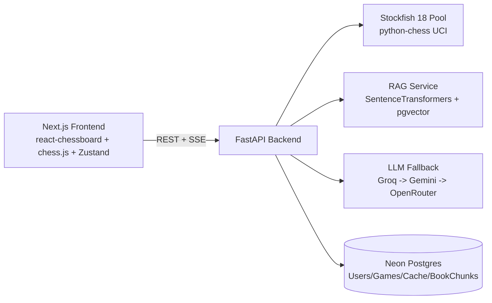

# ChessCoach AI

**ChessCoach AI** is a web chess coaching MVP that combines Stockfish engine analysis, chess-book RAG retrieval, and LLM explanations.

> Tagline: **"The chess engine that explains the why."**

## Architecture



## Tech Stack


## Screenshot


## Features

- Interactive chessboard with legal move validation (chess.js)
- Real-time Stockfish SSE depth streaming
- Position concept extraction (tactical + strategic)
- LLM coaching explanation with 3-tier provider fallback
- Book-based RAG references from public-domain chess books
- Full game review from PGN or Lichess URL
- JWT auth and saved game management
- Analysis caching to reduce compute and API quota usage

## Quick Start

1. Clone and enter project:
   ```bash
   git clone <your-repo-url>
   cd chess-coach-ai
   ```
2. Create environment files:
   - `backend/.env` from `backend/.env.example`
   - `frontend/.env.local` from `frontend/.env.local.example`
3. Run with Docker Compose:
   ```bash
   docker-compose up --build
   ```

Frontend: `http://localhost:3000`  
Backend: `http://localhost:7860`

## Local Backend (venv, Python 3.14)

From a terminal:

```powershell
cd C:\Users\diaab\chess-coach-ai\backend
py -3.14 -m venv venv
venv\Scripts\activate
pip install -r requirements.txt
uvicorn app.main:app --reload --port 7860
```

For every new backend terminal session, always start with:

```powershell
cd C:\Users\diaab\chess-coach-ai\backend
venv\Scripts\activate
```

If activation worked, your prompt starts with `(venv)`.

## API Documentation

FastAPI docs: `http://localhost:7860/docs`

## Project Structure

```text
chess-coach-ai/
  frontend/        # Next.js 14 app
  backend/         # FastAPI app + RAG ingestion scripts
  docker-compose.yml
```

## Deployment Guide

### Backend (Hugging Face Spaces - Docker)

1. Create a new Docker Space.
2. Push `backend/` as the Space repository content.
3. Set environment variables in Space settings.
4. Space serves FastAPI on port `7860`.

### Frontend (Cloudflare Pages)

1. Connect your Git repository to Cloudflare Pages.
2. Build command: `npm run build`
3. Output directory: `.next`
4. Set `NEXT_PUBLIC_API_URL` to your deployed backend URL.

## License

MIT
